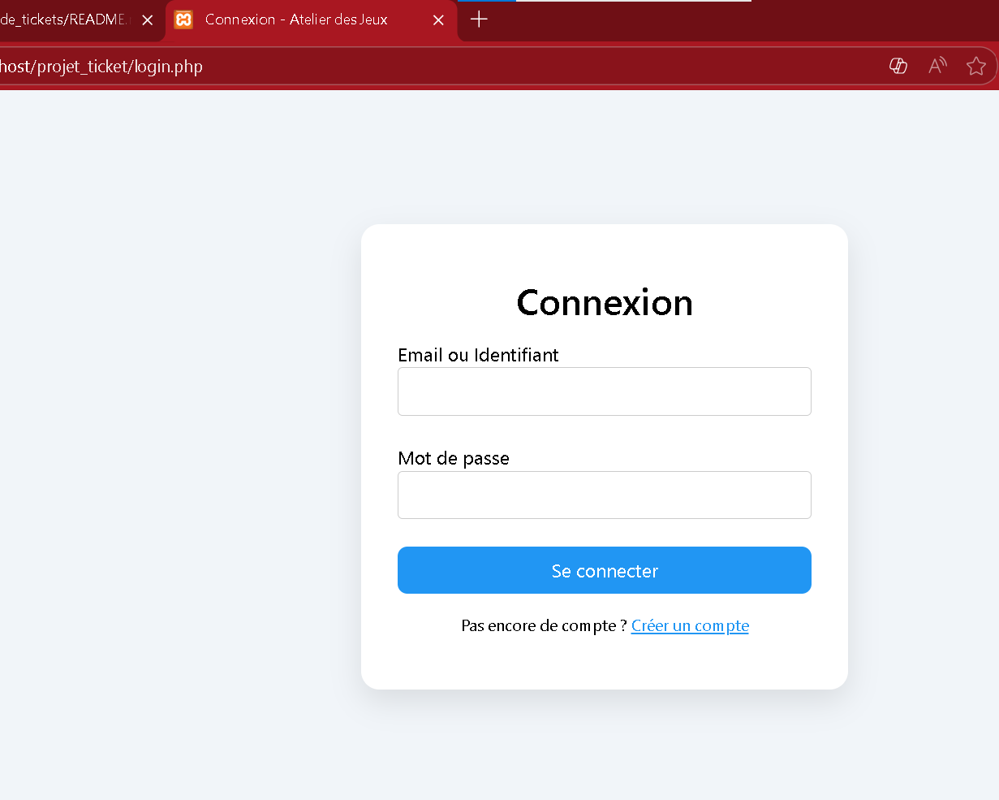
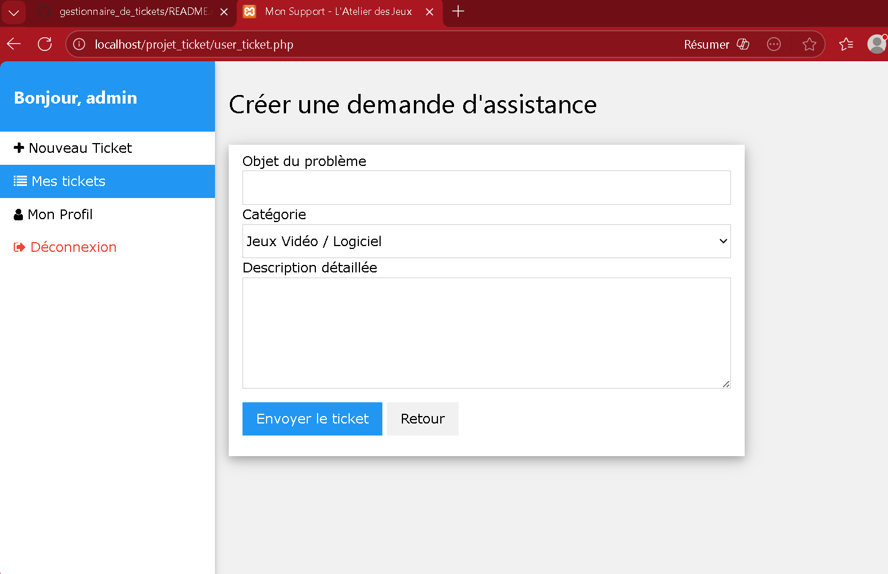
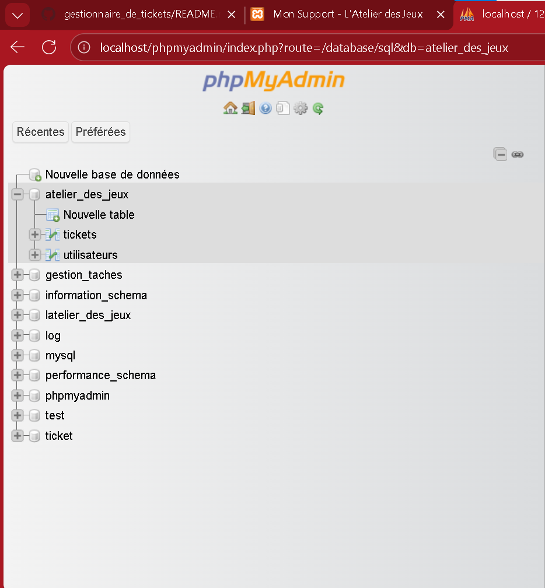
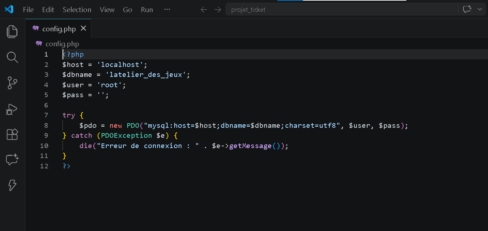
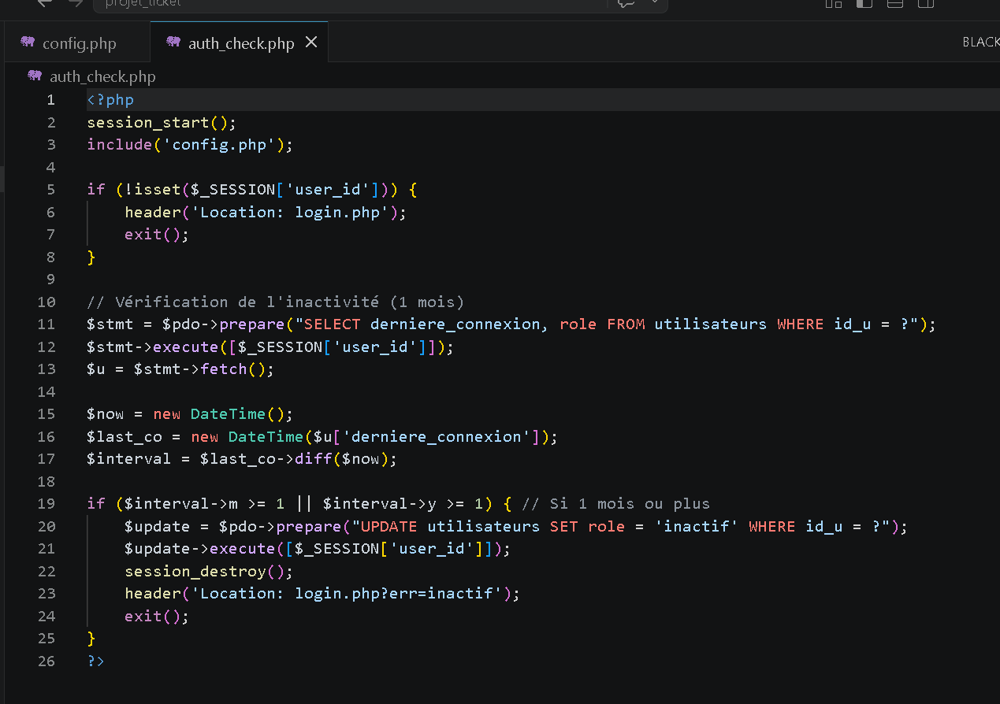
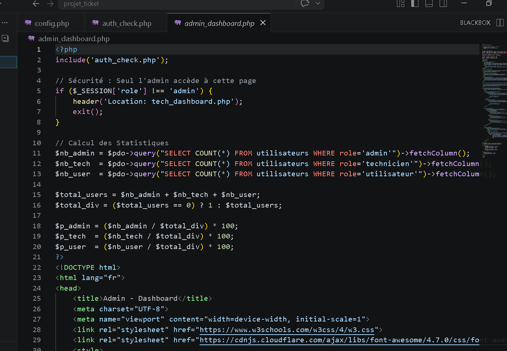
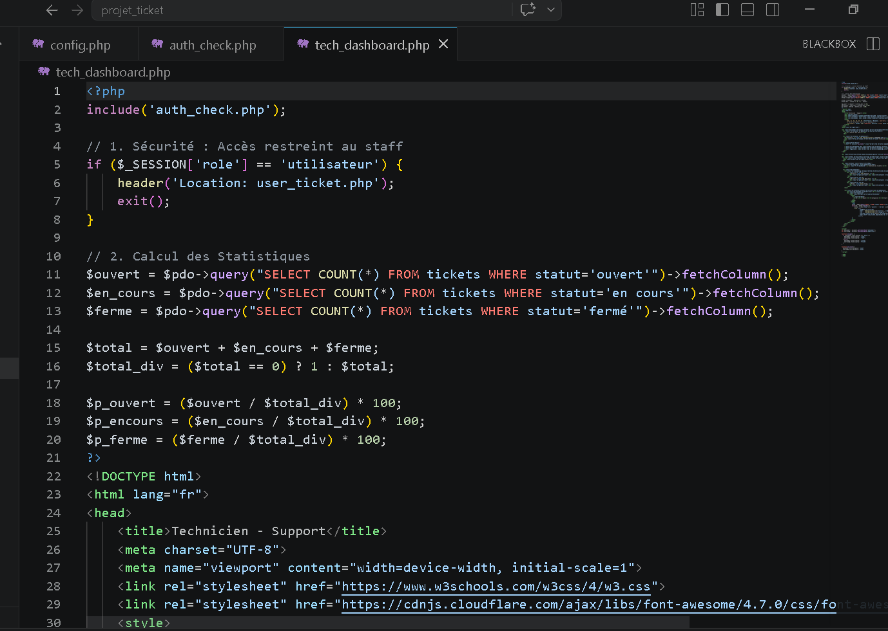
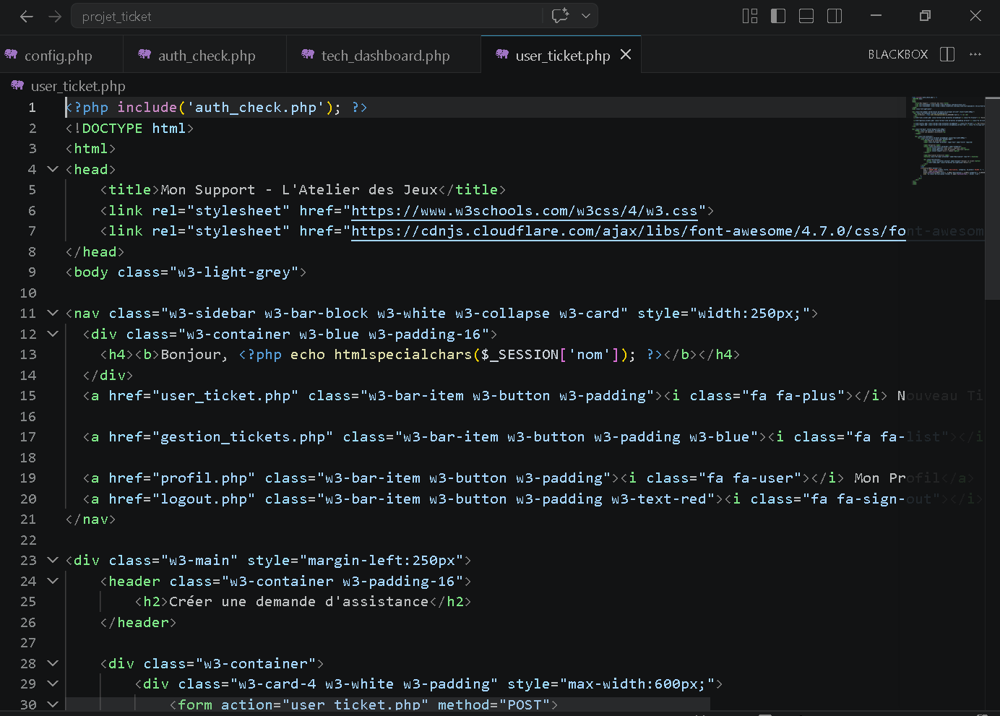
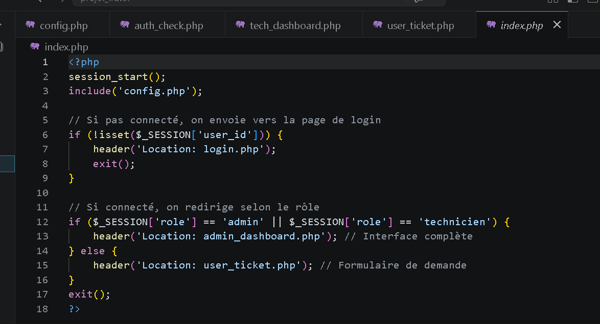

# Systeme de Gestion de Tickets - L'Atelier des Jeux

Ce projet est une application web de gestion de tickets d'assistance technique, permettant aux utilisateurs de soumettre des problemes et aux techniciens de les resoudre.

## Fonctionnalites
- Authentification Multi-roles : Administrateur, Technicien, Utilisateur.
- Gestion des Tickets : Creation, suivi de statut (Ouvert, En cours, Ferme).
- Tableau de Bord Admin : Statistiques en temps reel sur les utilisateurs et les tickets.
- Securite : Protection des routes et hachage des mots de passe.

## Apercu du Projet

### 1. Interface de Connexion


### 2. Dashboard Administrateur


### 3. Structure de la Base de Donnees


---

## Conception de la Base de Données (MCD)

La structure de données a été conçue pour garantir l'intégrité et la traçabilité des tickets. Voici le Modèle Conceptuel de Données (MCD) du projet :


### 📂 Description des Entités :
* **Utilisateurs** : Gère les comptes (Admin, Technicien, Client).
* **Tickets** : Contient le titre, la description, la date et le statut (Ouvert/Fermé).
* **Services/Catégories** : Permet de classer les incidents (Réseau, Matériel, Logiciel).
* **Interventions** : Historique des actions effectuées par le technicien sur un ticket.

---


## Technologies Utilisees
- Backend : PHP (PDO)
- Frontend : HTML5, CSS3 (W3.CSS / Bootstrap)
- Base de donnees : MySQL (XAMPP / PHPMyAdmin)

## Identifiants de Test
| Role | Identifiant | Mot de passe |
| :--- | :--- | :--- |
| Administrateur | admin | admin123 |
| Technicien | technicien | tech123 |
| Utilisateur | mdupont | password |

## Installation Locale
1. Cloner le projet : git clone https://github.com/oumaimasaoui377/gestionnaire_de_tickets.git
2. Importer le fichier .sql dans PHPMyAdmin.
3. Configurer config.php avec vos acces locaux.
4. Lancer par localhost.
5. # Système de Gestion de Tickets (IT Support)

##  Vision Approfondie du Projet
Ce projet dépasse la simple interface de saisie. Il s'agit d'une solution full-stack conçue pour simuler un environnement de support technique réel, en mettant l'accent sur l'intégrité des données, la sécurité des accès et l'automatisation du flux de travail .

---

## Architecture Technique & Logique

### 1. Le Modèle Conceptuel 
Le système repose sur une architecture relationnelle robuste sous **MySQL**. La logique métier est centrée sur la relation entre les entités :
* **Gestion des Rôles :** Utilisation de sessions PHP pour segmenter les privilèges (Admin vs Technicien vs Client).
* **Intégrité Référentielle :** Liaison stricte entre les tables `Users` et `Tickets` via des clés étrangères, garantissant qu'aucun ticket n'est "orphelin".

### 2. Flux de Travail 
Le projet implémente un cycle de vie dynamique pour chaque incident :
1.  **Soumission :** Capture de l'incident avec horodatage automatique.
2.  **Traitement :** Changement d'état en temps réel dans la base de données lors de l'attribution à un technicien.
3.  **Résolution :** Archivage logique de l'incident après confirmation de clôture.

### 3. Sécurité & Optimisation
* **Protection SQL :** Implémentation de requêtes préparées (PDO) pour contrer les injections SQL.
* **Contrôle d'Accès :** Système de filtrage par session pour empêcher l'accès direct aux URLs sensibles (ex: `admin_dashboard.php`) sans authentification préalable.

---

##  Structure du Système
```text
├── config/             # Connexion PDO sécurisée
├── core/               # Logique métier et fonctions de sécurité
├── public/             # Assets (CSS personnalisé, JS, Images)
├── views/              # Interfaces utilisateurs (Vues)
└── database/           # Script SQL complet (MCD/MLD)
```


##  Explication du code

###  1. Configuration (`config/`)
Ce dossier contient la connexion à la base de données.

- Fichier principal : connexion DB  
- Utilisé dans tout le projet  




---

###  2. Authentication (`auth_check/`, `login/`, `register/`, `logout/`)

####  `auth_check/`
- Vérifie si l’utilisateur est connecté  
- Protège les pages sensibles  

####  `login/`
- Vérifie email + password  
- Crée une session  

####  `register/`
- Ajoute un nouvel utilisateur dans la base  

####  `logout/`
- Supprime la session  



---

### 3. Admin Dashboard (`admin_dashboard/`)
- Affiche toutes les informations globales  
- Permet la gestion des utilisateurs et tickets  

📸 Screenshot du code :


---

###  4. Technicien (`tech_dashboard/`)
- Affiche les tickets assignés  
- Permet de modifier le statut  



---

###  5. Utilisateur (`user_ticket/`, `profil/`)

#### `user_ticket/`
- Création de ticket  
- Envoi vers la base de données  

####  `profil/`
- Informations utilisateur  



---

### 6. Gestion des tickets

####  `gestion_tickets/`
- CRUD des tickets (Create, Read, Update, Delete)  

####  `view_ticket/`
- Affiche les détails d’un ticket  

####  `modifier_statut/`
- Change l’état du ticket  

####  `log_view/`
- Sauvegarde l’historique des modifications  


---

### 7. Main (`index/`)
- Redirection حسب rôle (admin / technicien / user)  



---

## Logique globale du code

1. L’utilisateur se connecte  
2. Le système vérifie avec `auth_check`  
3. User crée ticket (`user_ticket`)  
4. Admin gère ou assigne ticket  
5. Technicien traite ticket  
6. Les modifications sont enregistrées dans `log_view`  

---

