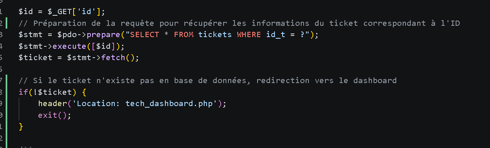
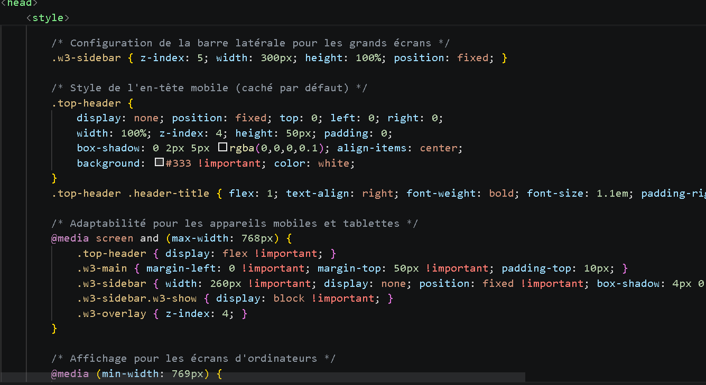
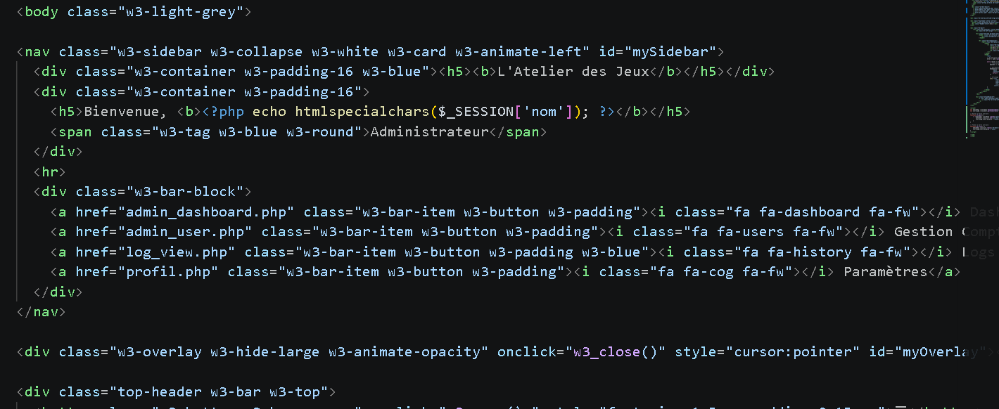

# Site de Gestion de Tickets - L'Atelier des Jeux

Ce projet est un gestionnaire de tickets fonctionnel pour la société "L'atelier des jeux". Chaque personne peut se créer un compte et donc devenir utilisateur, ces personnes pourront faire un ticket qui a un sujet, un menu déroulant pour choisir la catégorie de sa demande et une description à ajouter pour plus de précisions. Ces tickets seront reçus par le technicien sur son dashboard, il gère les tickets donc les résoudre, indiquer s'ils sont ouverts (pas traîtés), en cours, ou fermés (terminés). Et l'administrateur, lui, gère les utilisateurs, qui se connecte et quand, avec les heures précises et le pouvoir de créer, lire, modifier et supprimer un utilisateur, un technicien ou un admin.

## Fonctionnalites
- Authentification Multi-roles : Administrateur, Technicien, Utilisateur, Inactif.
- Gestion des Tickets : Créer, lire (suivi de statut (Ouvert, En cours, Fermé)), modifier et supprimer.
- Tableau de Bord Admin : Statistiques en temps réél sur les utilisateurs.
- Tableau de Bord Technicien : Statistiques en temps réél sur les tickets crééent.
- Sécurité : Hachage des mots de passe.    

## Apercu du Projet

### Interface de Connexion

### Interface de Création de Compte

## Administrateur
### Dashboard Administrateur

### Gestion des Comptes

### Tableau des Logs de Connexion

### Paramètres du Compte Administrateur

## Technicien 
### Dashboard Technicien

### Vue d'un Ticket

### Paramètres du Compte Technicien

## Utilisateur
### Dashboard Utilisateur

### Historique des tickets de l'Utilisateur

### Paramètres du Compte Utilisateur

## Structure de la Base de Donnees
### Les Différentes Tables

### Table "tickets"

### Table "utilisateurs"

## Conception de la Base de Données

La structure de données a été conçue pour garantir l'intégrité et la traçabilité des tickets. Voici le Modèle Conceptuel de Données (MCD) du projet :

### Dictionnaire de Données (utilisateur)

### Dictionnaire de Données (tickets)

---

## Technologies Utilisees
- Backend : PHP
- Frontend : HTML/CSS (W3.CSS)
- Base de donnees : MySQL (XAMPP)

## Identifiants de Test
| Role | Identifiant | Mot de passe |
| :--- | :--- | :--- |
| Technicien | technicien | tech123 |
| Utilisateur | mdupont | password |

Vous pouvez également créer votre propre utilisateur en vous créeant un compte en appuyant sur "Créer un compte", en entrant votre nom, prénom, adresse mail et un mot de passe.

---

## Explication du Code

### 1. Architecture Technique
3. Interface Utilisateur5. Modification du Statut

### 2.Gestion des Accès et Sécurité

### 3. Interface Utilisateur

### 4. Interface Technicien

### 5. Modification du Statut

### 6. Administration & Logs

--- 

## Perspectives d’amélioration

Dans le futur, plusieurs améliorations peuvent être envisagées pour enrichir le projet :

-  Ajout d’un système de notifications (email ou en temps réel)
-  Ajout d’un système de priorisation des tickets  
-  Implémentation d’un chat entre utilisateur et technicien  
-  Ajout de pièces jointes dans les tickets
-  Amélioration de la sécurité (mail de confirmation, authentification à 2 facteurs)  

---

##  Conclusion

Ce projet nous a permis de :

- Comprendre la structure d’un gestionnaire de tickets (de la base de donnée au code)
- Gérer les rôles (Admin/Technicien/User)
- Implémenter un système CRUD complet
- Manipuler une base de données et les sessions

---

##  Contact
Pour toute question ou suggestion :

- https://www.linkedin.com/in/oumaima-saoui-4b0a9a387/
- https://www.linkedin.com/in/yachar22/

---

