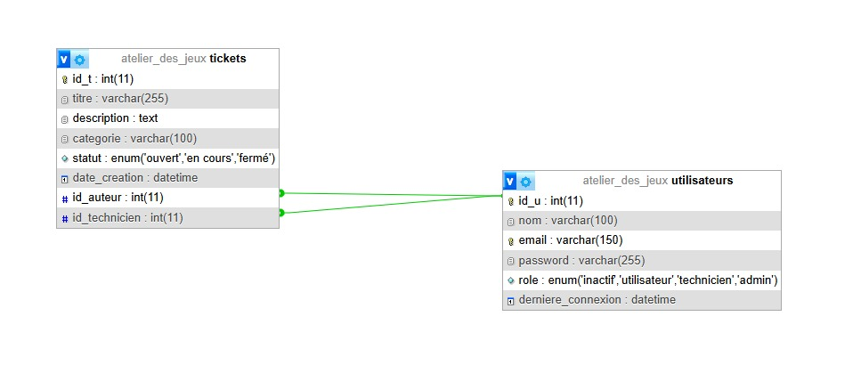
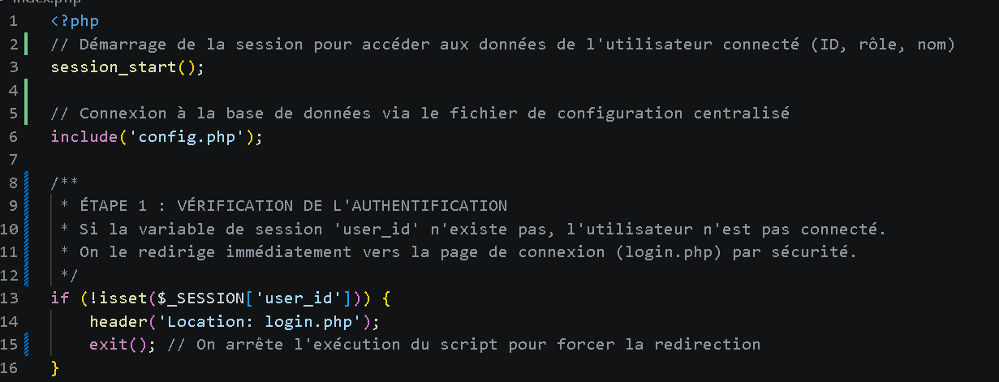
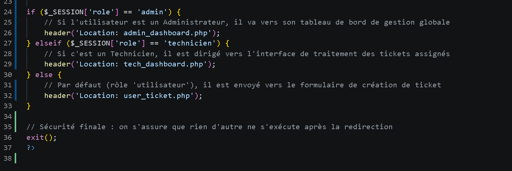
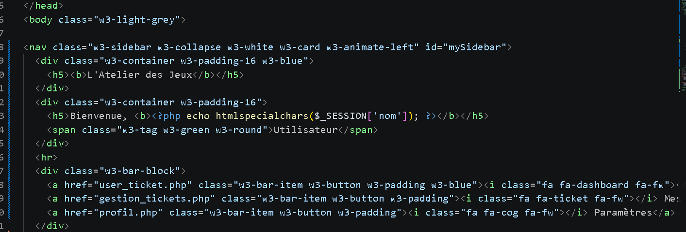
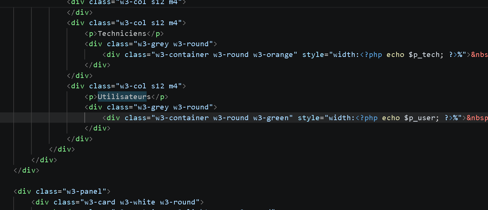
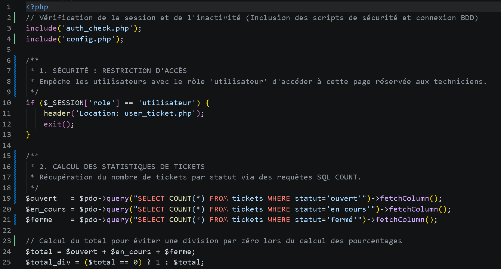
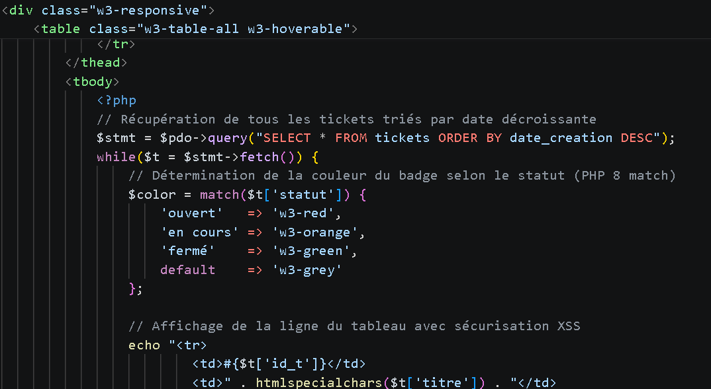
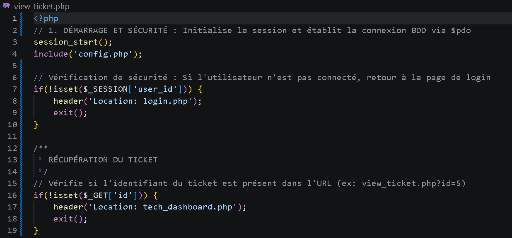
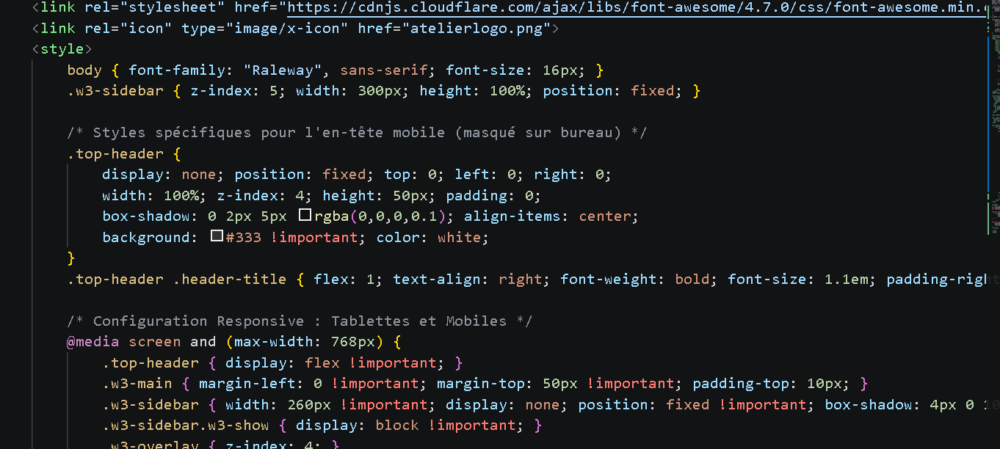

# Site de Gestion de Tickets - L'Atelier des Jeux

Ce projet est un gestionnaire de tickets fonctionnel pour la société "L'atelier des jeux". Chaque personne peut se créer un compte et donc devenir utilisateur, ces personnes pourront faire un ticket qui a un sujet, un menu déroulant pour choisir la catégorie de sa demande et une description à ajouter pour plus de précisions. Ces tickets seront reçus par le technicien sur son dashboard, il gère les tickets donc les résoudre, indiquer s'ils sont ouverts (pas traîtés), en cours, ou fermés (terminés). Et l'administrateur, lui, gère les utilisateurs, qui se connecte et quand, avec les heures précises et le pouvoir de créer, lire, modifier et supprimer un utilisateur, un technicien ou un admin.

## Fonctionnalites
- Authentification Multi-roles : Administrateur, Technicien, Utilisateur, Inactif.
- Gestion des Tickets : Créer, lire (suivi de statut (Ouvert, En cours, Fermé)), modifier et supprimer.
- Tableau de Bord Admin : Statistiques en temps réél sur les utilisateurs.
- Tableau de Bord Technicien : Statistiques en temps réél sur les tickets crééent.
- Sécurité : Hachage des mots de passe.    

## Apercu du Projet

### Interface de Connexion

### Interface de Création de Compte

## Administrateur
### Dashboard Administrateur

### Gestion des Comptes

### Tableau des Logs de Connexion

### Paramètres du Compte Administrateur

## Technicien 
### Dashboard Technicien

### Vue d'un Ticket

### Paramètres du Compte Technicien

## Utilisateur
### Dashboard Utilisateur

### Historique des tickets de l'Utilisateur

### Paramètres du Compte Utilisateur

## Structure de la Base de Donnees
### Les Différentes Tables

### Table "tickets"

### Table "utilisateurs"

## Conception de la Base de Données

La structure de données a été conçue pour garantir l'intégrité et la traçabilité des tickets. Voici le Modèle Conceptuel de Données (MCD) du projet :

### Dictionnaire de Données (utilisateur)

### Dictionnaire de Données (tickets)

---

## Technologies Utilisees
- Backend : PHP
- Frontend : HTML/CSS (W3.CSS)
- Base de donnees : MySQL (XAMPP)

## Identifiants de Test
| Role | Identifiant | Mot de passe |
| :--- | :--- | :--- |
| Technicien | technicien | tech123 |
| Utilisateur | mdupont | password |

Vous pouvez également créer votre propre utilisateur en vous créeant un compte en appuyant sur "Créer un compte", en entrant votre nom, prénom, adresse mail et un mot de passe.

---

## Explication des Fichiers 

📁 Cœur du Système
config.php : Point central de connexion à la base de données. Il définit le fuseau horaire et configure le mode d'erreur PDO pour faciliter le débogage.

auth_check.php : Script de sécurité inclus sur chaque page protégée. Il vérifie l'existence de la session et gère la désactivation automatique des comptes inactifs après un mois.

index.php : Aiguilleur principal (Router). Il redirige l'utilisateur vers le bon tableau de bord en fonction de son rôle (admin, technicien, ou utilisateur).

🔐 Authentification & Profils
login.php : Gère la connexion des utilisateurs avec vérification des identifiants et hachage MD5.

register.php : Formulaire d'inscription créant automatiquement un identifiant (initiale du prénom + nom) et assignant le rôle utilisateur par défaut.

logout.php : Détruit la session et redirige vers l'accueil.

profil.php : Permet à l'utilisateur de modifier ses informations personnelles, notamment son mot de passe.

🎫 Gestion des Tickets
user_ticket.php : Interface de création de tickets pour les clients/utilisateurs.

gestion_tickets.php : Liste complète des tickets appartenant à l'utilisateur connecté.

details_ticket.php : Vue détaillée d'un ticket spécifique (sécurisée pour n'afficher que ses propres tickets).

view_ticket.php : Interface technique permettant de visualiser un ticket et de mettre à jour son statut (ouvert, en cours, fermé).

modifier_statut.php : Script de traitement rapide utilisé par l'administration pour changer l'état d'un ticket.

🛡️ Administration & Dashboard
admin_dashboard.php : Tableau de bord global affichant les statistiques de répartition des utilisateurs et les dernières activités.

tech_dashboard.php : Interface dédiée aux techniciens pour le suivi des volumes de tickets par statut.

admin_user.php / edit_user.php : Outils de gestion CRUD (Créer, Lire, Mettre à jour, Supprimer) pour administrer les comptes utilisateurs.

log_view.php : Historique des connexions et des actions pour assurer la traçabilité du système.

🔒 Sécurité Mise en Œuvre
Requêtes Préparées : Utilisation systématique de prepare() et execute() pour prévenir les injections SQL.

Protection XSS : Utilisation de htmlspecialchars() lors de l'affichage des données saisies par les utilisateurs.

Gestion des Sessions : Isolation des interfaces par vérification stricte de la variable $_SESSION['role'].

Audit : Système de logs pour tracer les modifications critiques (changements de statuts, etc.).

## Explication du Code

### 1. La Vérification d'Authentification
Explication flash : Vérification de la session pour bloquer l'accès aux utilisateurs non connectés.

Code : '''$stmt->prepare("... WHERE id_t = ?")'''
Signif : Bloque les injections SQL en nettoyant les données avant l'exécution.

### 2. L'Aiguillage selon le Rôle
Explication flash : Redirection automatique vers l'interface spécifique selon le rôle (Admin ou Technicien).

Code : $color = match($status) { ... }
Signif : Automatise la couleur des badges selon le statut du ticket (plus rapide qu'un if).

### 3. La Protection XSS
Explication flash : Nettoyage des données affichées pour empêcher les attaques par injection de script (XSS).

Code : htmlspecialchars($donnees)
Signif : Empêche le piratage par script (XSS) en neutralisant les balises HTML.

### 4. La Modification de Statut
Explication flash : Modification précise d'une donnée existante en ciblant son identifiant unique (ID).

Code : UPDATE tickets SET statut = ?
Signif : Modifie une information précise en base de données sans toucher au reste.

### 5. Le Système de Déconnexion (Logout)
Explication flash : Suppression complète des données de session pour fermer l'accès de l'utilisateur en toute sécurité.

### 6. La Récupération Sécurisée
Explication flash : Utilisation d'une requête préparée pour récupérer les détails d'un ticket spécifique via son identifiant unique dans l'URL.

### 7. Le "Match" PHP 8
Explication flash : Emploi de la structure match (nouveauté PHP 8) pour attribuer dynamiquement une couleur au badge selon l'état du ticket.

--- 

## Perspectives d’amélioration

Dans le futur, plusieurs améliorations peuvent être envisagées pour enrichir le projet :

-  Ajout d’un système de notifications (email ou en temps réel)
-  Ajout d’un système de priorisation des tickets  
-  Implémentation d’un chat entre utilisateur et technicien  
-  Ajout de pièces jointes dans les tickets
-  Amélioration de la sécurité (mail de confirmation, authentification à 2 facteurs)  

---

##  Conclusion

Ce projet nous a permis de :

- Comprendre la structure d’un gestionnaire de tickets (de la base de donnée au code)
- Gérer les rôles (Admin/Technicien/User)
- Implémenter un système CRUD complet
- Manipuler une base de données et les sessions

---

##  Contact
Pour toute question ou suggestion :

- https://www.linkedin.com/in/oumaima-saoui-4b0a9a387/
- https://www.linkedin.com/in/yachar22/

---
